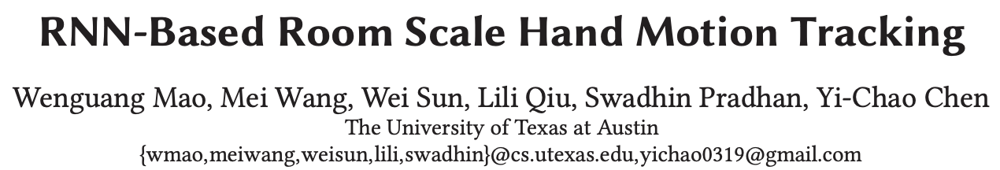

# rnn-tracking

## 1.简介
本项目是对论文RNN-Based Room Scale Hand Motion Tracking的简单复现


## 2.目录
```plaintext
project-root/
├── README.md            # 项目简介
├── src/                 # 源代码
│   ├── Preprocess/      # 使用2d music对输入数据进行处理
│   ├── RNN/             # 使用RNN预测真实位置
│   └── VisualTracking/  # 使用视觉方法获得真实位置
├── data/                # 数据存放目录
├── tests/               # 测试代码
├── docs/                # 文档
└── requirements.txt     # 依赖库列表
```